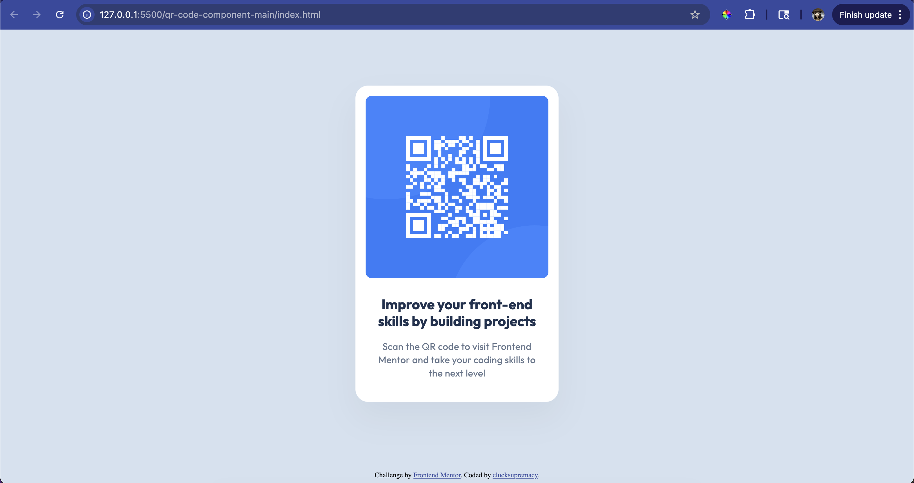
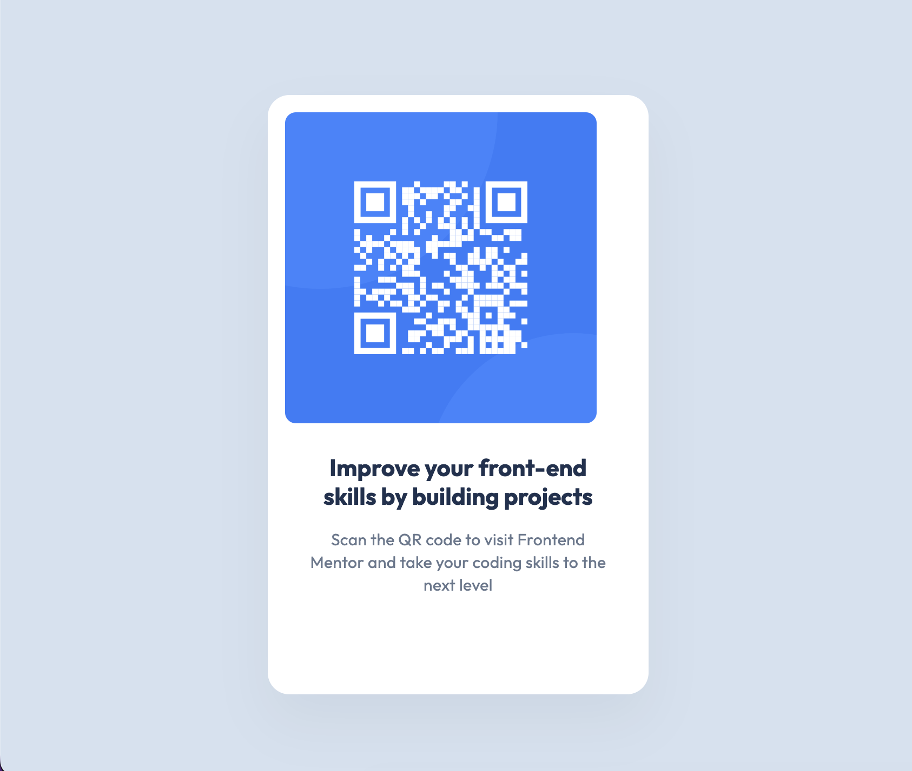
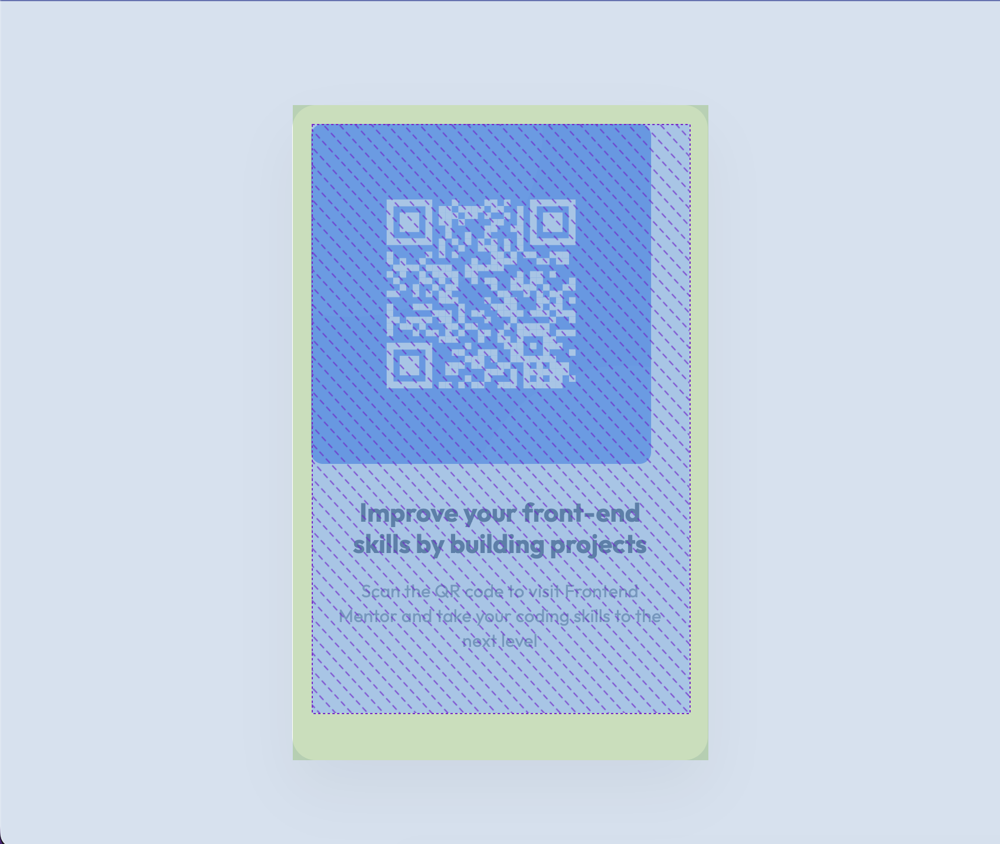

## Table of contents

- [Overview](#overview)
  - [Screenshot](#screenshot)
  - [Links](#links)
- [My process](#my-process)
  - [Built with](#built-with)
  - [What I learned](#what-i-learned)
- [Author](#author)

## Overview

### Screenshot

### Links

- Solution URL: [https://github.com/clucksupremacy/qr-code](https://github.com/clucksupremacy/qr-code)
- Live Site URL: [https://cluck-qr-code.netlify.app/](https://cluck-qr-code.netlify.app/)

## My process

### Built with

- Semantic HTML5 markup
- CSS custom properties
- Flexbox
- Mobile-first workflow

### What I learned

This project was a good way to review some basics while getting accustomed to the Frontend Mentor project workflow. With most of the planning done on paper, working on the project was straightforward. The only real hiccup I encountered was wrangling with extra white space, which I remedied with a simple "box-sizing: border-box" to account for padding. Here are some pictures of the issue before fixing: 

## Author

- Website - [clucksupremacy](https://github.com/clucksupremacy)
- Frontend Mentor - [@clucksupremacy](https://www.frontendmentor.io/profile/clucksupremacy)